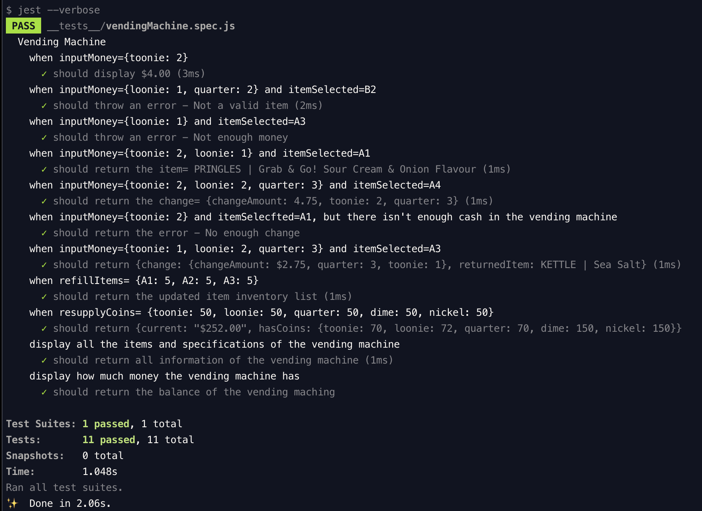

# Vending Machine

A vending machine app based on Javascript ES6(ECMAScript 2015) class

&nbsp;

---

&nbsp;

## Test results

Run test by `yarn test`

&nbsp;

---

&nbsp;

## License

- Structural code is open-sourced under the [MIT license](/LICENSE.md).
  &nbsp;

- Learning materials content is copyright (c) 2019 RED Academy.

<3
